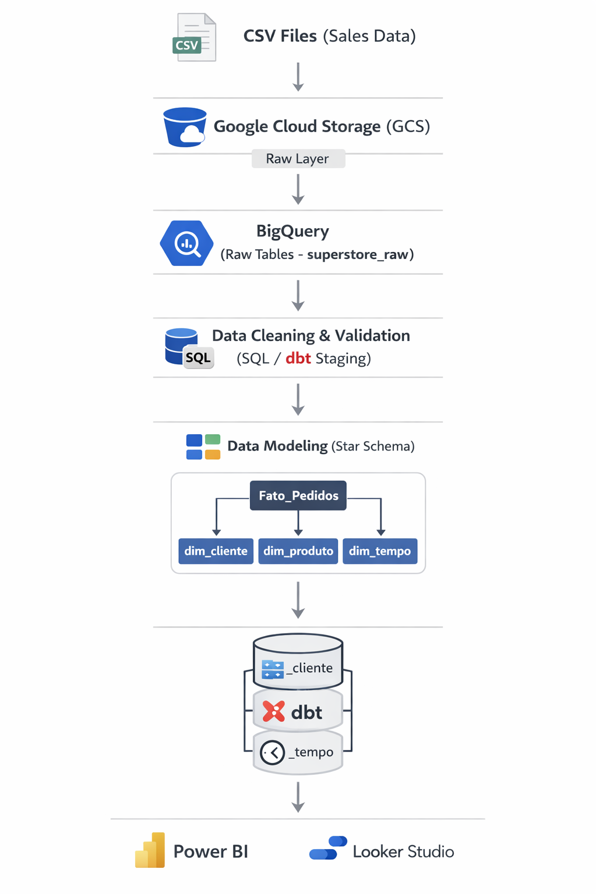

# 📊 ETL Pipeline – Data Processing Project

This project was developed as part of the Laboratória Bootcamp and focuses on building an end-to-end ETL (Extract, Transform, Load) pipeline for data processing and analysis.

The goal is to collect raw data, clean and transform it, and make it ready for analysis and visualization.

---

## 🎯 Objective
- Extract data from source files;
- Transform and clean the data;
- Load processed data into a structured format;
- Prepare data for analysis and reporting;

---

## ⚙️ Tools & Technologies
- BigQuery;
- drawSQL;
- Google Sheets;
- Jupyter Notebook;
- Python;
- SQL;

---

## 🔍 Methodology
The project was structured into three main steps:

1. Extract
- Data collected from source files (CSV / API / etc.)

2. Transform
- Data cleaning (null values, duplicates);
- Data type corrections;
- Feature creation;
- Standardization;
  
3. Load
- Data stored in structured format;
- Ready for analysis or visualization;

---

## 📊 Key Improvements from ETL Process

- Cleaned and standardized raw data;
- Handled missing values;
- Improved data consistency;
- Created structured dataset for analysis;

---

## ⚙️ Data Pipeline
The data pipeline was designed to ensure scalability, data quality, and efficient transformations.
It follows a layered architecture:

- **Raw Layer**: ingestion of original CSV data into BigQuery
- **Staging Layer**: data cleaning and standardization
- **Data Modeling Layer**: transformation into a star schema
- **Analytics Layer**: optimized tables for reporting and analysis

Future improvements include orchestration with Cloud Composer (Airflow) and transformation management with dbt.

---

## ✔️ “Business impact”
This pipeline ensures reliable and clean data, improving data quality for decision-making.

